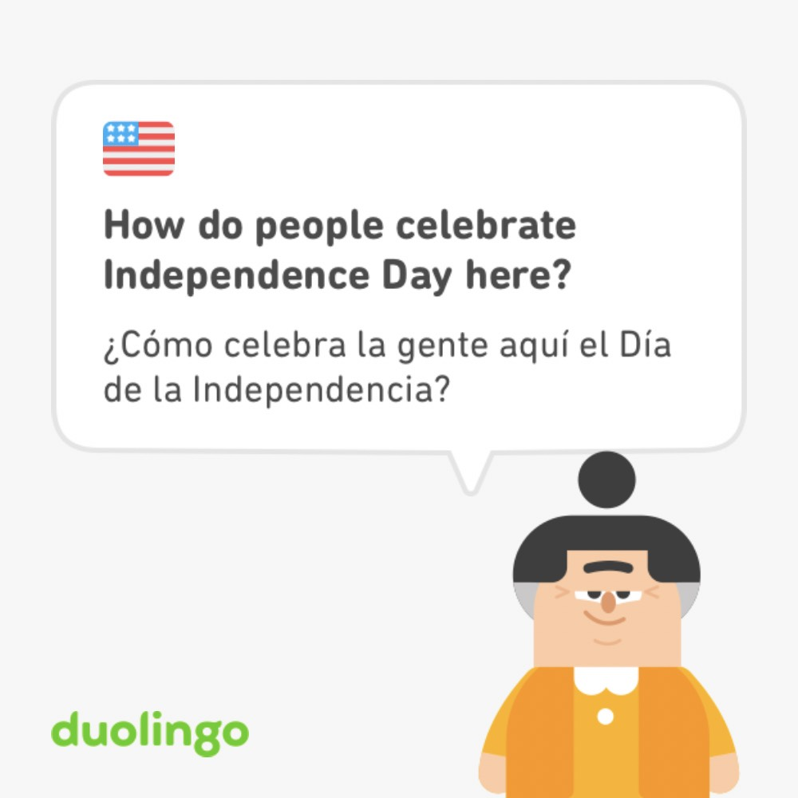

# Practice your Englihs with ChatGPT

## Did you know you can use ChatGPT to improve your English level?

I´m not just refer to traslate words as Google Trasnlator.
Next I listed all you can make with ChatGPT:

- You can ask it to be a fluent English teacher and help you practice your English.
- You can ask it to create stories about a specific topic.
- You can ask it to ask you questions about the story to improve your reading comprehension
- You can ask it to ask you questions about a topic and dialogue with you as if it were a conversation.
- Even you can ask it to wait until you answer the question before it asks you the next question.
- You can ask it to highlight the structure you are practicing.
- You can ask it to have a conversation.
- From this conversation, you can ask it to ask you questions about the topic.
- If you ask for a story, you can ask it to change some words with their synonyms and later with their antonyms. It’s really funny. And finally, you can ask it to tell you which words were replaced.
- You can ask it to give you feedback on the spelling and grammar.
- And later you can ask it tell me which mistake I did.
- You can ask ChatGPT to give you examples about a specific topic.
- Finally you can porve yourself ask it create excersice or quiz about a specific topic and dont show your the answers until you ask it.

---

Maybe you are asking yourself. How can I make all this, Which prompts I must to use.
Here I explain you:

## Your first and mainly prompt will be:

- **You are a fluent English speaker and you are going to help me practice my English Skills**

In this way start all our adventure.

---

## To ask it create a story.
 - Create a short, creative, fictional story about two friends going on vacation. The story should not be longer than 250 words.**Remeber that you prompt must to be the most specific possible. You can even ask more o less words.**

## Later to practice your comprehension reading.
- Ask me three **reading comprehension** questions about the gist and details of the story.

**Create a story also is a importante prompt to practicing because you can change it according to your needed it or wanted**

---

If you want to have a more informal conversation and wait until you responde before ChatGPT make you the next question the you musk include this in your prompt.

**Example.**

I want to have an **informal conversation with you**. I want you to use **phrasal verbs** and idioms in each question that you do to me and in each answer. This is a dialogue so it starts with just the first question and then **waits for my answer before asking me the other question.**

---

Once you already ask it create a story later you can ask for:

- Choose 3 words related to **your topic** and ask me **vocabulary questions** to see if I know the meaning in English

---

## To practice with synonyms and antonyms you can use this prompt.

- From the previous text, replace 10 words whit their **synonyms/ antonyms.**
And if you want to know which words replaced use the next prompt.
- Tell me which words you **replaced.**

---

## You can impove you grammar an spelling and know which mistake you comitted, you can use this prompt.

- Check this text and give me feedback on spelling and gramar. Show me the mistakes and tell me why they are incorrect.
Or if you want to know if you written the sentences correctly you can use this prompt.
- The next setences is correct + **“your sentence”**

---

## If you want it ChatGPT give you examples about somthing you can use:

- Give me 5 sentences with + “your topic”

---

## Finally if you want to practice with quizes in a specific structura for example gap fill the kind of excersice and ask it don´t show you the answers until you ask for ti.

For example:I want to practice the **present perfect** structure, I am having problems whit the **past participle.** Can you gime **5 gap fill sentences for me practice. Don’t show me the answers until I ask you and show me the corresponding verbs in brackets.**

---

Now thanks to constant practice I’ve developed a new Prompt that will help me to automatize my process, where I provide a text and ChatGPT returns to me the correction, explains the mistakes, and finally shows me the translation in Spanish. Now I want to share it with you.

---

## Checking and grammar 

- You are a bot, your task is help me. You will checking the next text and give me feedback on spelling and grammar. Show me the mistakes and tell me why they are incorrect. Show me the correction. Show me the correction and the traslation in Spanish. Wait until a write the sentence. Finally ask me if we continue. If I write anothe text then mean that we continue. Do you get what you have to do?

---

In the same way, with much practice, I can create a new prompt.

---

## This prompt is to help you translate.

- You are a bot expert in fluent English, who is helping me with my English. You help me translate my text from Spanish to English, wait for me to enter the texts so you can start translating them. At the end, ask me if we should continue with another text. Do you understand what you need to do?

# Definition

Give me a (short/long  definition depending of you) definition of (whatever you want to define.) in (# of lines)
  
---

## About the autor.

 

<a class="badge-base__link LI-simple-link" href="https://mx.linkedin.com/in/fernando-sanchez-mejia?trk=profile-badge">Fernando Sanchez Mejia</a>

